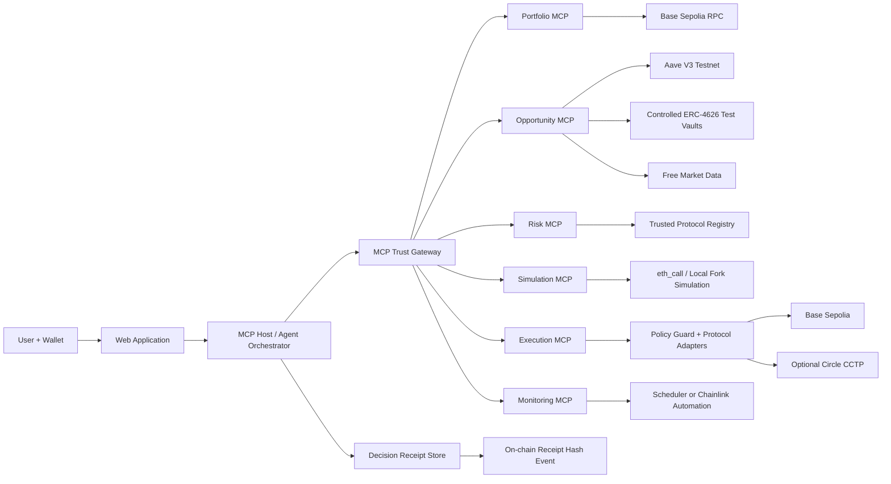

# ProofYield MCP

> **A policy-bounded, explainable DeFi treasury agent that uses Model Context Protocol (MCP) to research opportunities, reject unsafe choices, simulate an execution plan, obtain user approval, execute on testnets, and produce a verifiable decision receipt.**

**Project status:** Hackathon architecture and implementation specification  
**Environment:** Testnets and free-tier/public infrastructure only  
**Primary MVP network:** Base Sepolia  
**Optional cross-chain extension:** Base Sepolia ↔ Arbitrum Sepolia using test USDC and Circle CCTP  
**Document date:** 18 July 2026

---

## 1. Executive summary

ProofYield MCP is not intended to be another dashboard that lists APYs, and it must not be pitched as an AI that guarantees the highest profit.

The project is an **MCP-native treasury decision and execution system**. A user gives it a financial intent such as:

> “I have 1,000 test USDC. Keep risk moderate, do not use unknown protocols, retain at least 20% liquid, and find a better yield strategy.”

The system then:

1. Reads the user’s testnet wallet and current positions.
2. Collects opportunities from approved protocol adapters.
3. Rejects options that violate hard safety policies.
4. Calculates comparable net-return and risk metrics.
5. Produces a ranked recommendation and a visible reject list.
6. Compiles the recommendation into a typed execution plan.
7. Simulates every state-changing action.
8. Requires explicit user approval and wallet signing.
9. Executes only through allowlisted adapters and bounded permissions.
10. Verifies post-transaction state.
11. Records a **Decision Receipt** containing the data snapshot, policy checks, alternatives, simulation result, approval, and transaction hashes.
12. Monitors the position and proposes a rebalance if a user-defined condition becomes true.

The LLM is responsible for interpreting intent and explaining decisions. It is **not** trusted to invent contract addresses, produce arbitrary calldata, hold private keys, bypass policies, or make the final security decision.

---

## 2. The problem

DeFi users face a fragmented decision process. To deploy one asset efficiently, they may need to compare:

- Wallet balances and existing positions
- Lending and vault rates
- Token prices
- Gas costs
- Swap slippage
- Bridge costs and bridge risk
- Liquidity and withdrawal conditions
- Protocol history and contract risk
- Asset and oracle risk
- User-specific concentration limits
- Whether the expected improvement is large enough to justify moving at all

Most products solve only part of this flow:

- Dashboards display opportunities.
- Aggregators route swaps or bridges.
- Vaults automate one predefined strategy.
- Bots execute trigger-action recipes.
- AI interfaces summarize information.

The user must still connect the pieces, assess whether the information is trustworthy, and understand what an automated system is allowed to do.

The core product problem is therefore not merely “find the highest APY.” It is:

> **Convert a user’s treasury intent into an evidence-backed, policy-compliant, simulated, user-approved, and verifiable sequence of on-chain actions.**

---

## 3. Product thesis

The project should be positioned as:

> **An MCP-native, policy-bounded autonomous treasury agent for verifiable DeFi decision-making and execution.**

Do not position it as:

- A guaranteed-profit trading bot
- A black-box investment adviser
- A fully autonomous wallet with unrestricted access
- A universal optimizer for every chain and protocol
- A high-frequency trading system
- A mainnet-ready financial product

The hackathon version is a **safe testnet research prototype** that demonstrates a credible architecture for institutional-style treasury automation.

---

## 4. Honest novelty assessment

### 4.1 What is not novel by itself

The following ideas already exist in the market and should not be claimed as unique:

- Automated DeFi strategies triggered by bots
- Yield rebalancing between lending markets or vaults
- Smart-account-based non-custodial automation
- Multi-step DeFi transaction recipes
- Autonomous agents that periodically evaluate rates
- Cross-chain refuelling or treasury workflows
- AI interfaces that recommend assets or strategies

Examples include:

- **DeFi Saver**, which defines triggers, recipes, strategies, and bot-executed automations through user wallets.
- **Brahma**, which provides programmable smart-account execution, agents, and examples such as Morpho rebalancing and cross-chain refuelling.
- **Giza**, whose agent lifecycle includes evaluating protocol yields and rebalancing allocations.
- **Enzyme**, which provides self-custodial vault infrastructure, roles, policies, and integrations.

Therefore, “an AI agent that moves funds to a higher-yield protocol” is not enough to win on novelty.

### 4.2 Competitive comparison

| System | What it already demonstrates | Where ProofYield should differentiate |
|---|---|---|
| DeFi Saver | Trigger-and-recipe automations executed by bots through authorized user wallets | Open MCP tool orchestration, evidence provenance, counterfactual reject list, and per-decision receipts |
| Brahma | Smart-account workflows, DeFi agents, yield rebalancing, and cross-chain automation patterns | User policy compiled into a visible and testable constitution; strict MCP trust boundary; reproducible decision proof |
| Giza | Agents that evaluate yields and rebalance allocations | Protocol-independent MCP capability graph plus explicit simulation, rejected alternatives, and user-verifiable execution lineage |
| Enzyme | Self-custodial vaults, roles, policies, and protocol adapters | Conversational intent-to-policy compilation and an MCP-native research-to-execution workflow for an individual treasury |
| ProofYield | Not a new yield primitive; a secure orchestration and verification layer | Makes agent reasoning inspectable, permissions bounded, execution reproducible, and every action attributable to policy and evidence |

The comparison should be presented honestly: ProofYield is not replacing these systems. It is demonstrating a safer and more transparent **agent-control plane** that could eventually orchestrate approved protocols or automation systems.

### 4.3 What can make this project meaningfully differentiated

ProofYield combines four ideas into one verifiable pipeline:

#### A. MCP-native financial capability graph

Every capability is exposed as a narrow, typed MCP tool rather than hidden inside one monolithic backend. The agent must visibly orchestrate portfolio, opportunity, risk, simulation, execution, and monitoring tools.

#### B. User policy as an enforceable constitution

The user’s preferences are converted into machine-readable limits such as:

- Allowed chains
- Allowed protocols
- Allowed assets
- Maximum position size
- Minimum liquid reserve
- Maximum slippage
- Maximum bridge exposure
- Maximum transaction value
- Maximum daily movement
- Minimum data freshness
- Minimum expected benefit before rebalancing
- Whether autonomous execution is disabled, approval-only, or bounded

These limits are checked by deterministic code and, where practical, enforced by a smart-account guard or policy contract. The LLM cannot override them.

#### C. Counterfactual decision proof

The system does not only show the selected strategy. It also shows:

- Which alternatives were evaluated
- Which alternatives were rejected
- Which policy or risk threshold caused each rejection
- How the chosen option changes if the user changes the horizon or risk tolerance
- Whether “do nothing” is better than moving funds

This makes the intelligence visible and testable.

#### D. Decision Receipt

Every recommendation and execution produces a reproducible evidence package containing:

- User intent and policy version
- Wallet snapshot
- Chain IDs and block numbers
- Opportunity data and timestamps
- Data provenance
- Candidate set
- Risk-gate results
- Score breakdowns
- Rejected alternatives
- Selected plan
- Simulation result
- User approval
- Transaction hashes
- Postcondition verification

A hash of this receipt can be emitted in an on-chain event, while the full JSON remains off-chain. This makes the agent auditable without placing large data on-chain.

### 4.4 The resulting novelty claim

A credible claim is:

> **ProofYield is a verifiable intent-to-execution layer for DeFi. It uses MCP to orchestrate specialized financial tools, compiles user intent into enforceable policy, explains rejected alternatives, requires simulation and approval, and produces an auditable decision receipt for every action.**

Do not claim that no other project has ever implemented any individual part. The novelty is the **combination, MCP-native orchestration, policy boundary, and proof-oriented user experience**.

---

## 5. The most important product innovation: the MCP Trust Gateway

A financial agent should not trust every connected MCP server equally. Tool output may be stale, incorrect, malicious, or contain prompt-injection text.

ProofYield therefore introduces an **MCP Trust Gateway** between the LLM host and all financial tools.

The gateway performs:

1. **Tool allowlisting** — Only registered MCP servers and tool versions are available.
2. **Schema pinning** — Input and output JSON schemas are versioned and hashed.
3. **Permission classification** — Tools are labelled read-only, planning, simulation, approval, or execution.
4. **Source provenance** — Every financial value includes source, chain, block number, and timestamp.
5. **Freshness validation** — Stale data is rejected before scoring.
6. **Output sanitization** — Tool output is treated as data, never as system instructions.
7. **Address validation** — Contract and token addresses come from a trusted registry, not generated text.
8. **Execution separation** — Read tools cannot submit transactions; execution tools cannot select arbitrary targets.
9. **Audit logging** — Tool calls, schema versions, policy decisions, and errors are recorded without secrets.
10. **Fail-closed behaviour** — Missing provenance, invalid schema, failed simulation, or uncertain chain state blocks execution.

This is highly relevant to an MCP hackathon because it addresses a real weakness of agent systems: connecting more tools increases capability, but it also increases the trust and permission surface.

---

## 6. Core user experience

### 6.1 Onboarding

The user:

1. Connects a testnet wallet.
2. Selects a simple policy preset or creates custom limits.
3. Chooses approval mode:
   - **Advisory:** recommendations only
   - **Approval required:** every execution is signed manually
   - **Bounded automation:** only pre-authorized actions within strict limits
4. Receives testnet tokens from supported faucets.

For the hackathon, default to **Approval required**.

### 6.2 Example intent

> “Allocate 1,000 Base Sepolia USDC. Keep 200 USDC liquid. Use only approved lending or ERC-4626 vaults. Maximum 60% per protocol. Do not bridge unless the expected annualized improvement is at least 3% after costs. Risk must remain moderate.”

### 6.3 Recommendation screen

The UI should show:

- Current portfolio
- Policy summary
- Data freshness and block number
- Number of opportunities analysed
- Eligible opportunities
- Rejected opportunities with reasons
- Proposed allocation
- Expected net return estimate
- Risk classification
- Estimated transaction costs
- Simulation status
- Required wallet actions
- “Do nothing” baseline

### 6.4 Approval screen

Before a signature, show a human-readable plan:

```text
Action 1: Approve exactly 800 test USDC to the approved Aave adapter
Action 2: Supply 600 test USDC to Aave V3 on Base Sepolia
Action 3: Deposit 200 test USDC into Mock Conservative Vault
Remaining liquid balance: 200 test USDC
Maximum slippage: 0.50%
Plan deadline: 10 minutes
Simulation: Passed
Policy checks: 14/14 passed
```

The wallet signs the actual testnet transaction or typed authorization. The MCP server never receives the seed phrase or raw private key.

### 6.5 Decision Receipt screen

After execution, show:

- Plan ID
- Receipt hash
- Transaction hashes
- Final balances
- Expected vs actual token movements
- Policy version
- Data snapshot time
- Whether every postcondition passed

---

## 7. System architecture



### 7.1 Architectural rule

The LLM may choose among **typed capabilities**, but it must never directly produce arbitrary transaction calldata.

The path must be:

```text
Natural-language intent
        ↓
Structured intent
        ↓
Deterministic policy
        ↓
Typed candidate data
        ↓
Deterministic eligibility gates
        ↓
Ranking and explanation
        ↓
Typed ActionPlan
        ↓
Policy validation
        ↓
Simulation
        ↓
User approval and signature
        ↓
Adapter-generated calldata
        ↓
Execution
        ↓
Postcondition verification
```

---

## 8. MCP server design

MCP is the centre of the project, not a decorative integration. The demo should visibly show the agent invoking several specialized tools.

### 8.1 Portfolio MCP

Responsibilities:

- Read native and ERC-20 balances
- Read approved protocol positions
- Calculate current allocation
- Return chain and block metadata

Example tools:

```text
portfolio.get_wallet_snapshot
portfolio.get_protocol_positions
portfolio.get_allowances
portfolio.get_allocation
```

Example structured output:

```json
{
  "wallet": "0x...",
  "chainId": 84532,
  "blockNumber": 12345678,
  "observedAt": "2026-07-18T00:00:00Z",
  "assets": [
    {
      "symbol": "USDC",
      "address": "0x036CbD53842c5426634e7929541eC2318f3dCF7e",
      "balance": "1000.000000",
      "decimals": 6
    }
  ],
  "source": "base-sepolia-rpc"
}
```

### 8.2 Opportunity MCP

Responsibilities:

- Return normalized opportunities from approved adapters
- Expose lending, vault, and optional bridge routes
- Provide APY source, liquidity proxy, withdrawal rules, and data freshness

Example tools:

```text
opportunity.list_lending_markets
opportunity.list_vaults
opportunity.get_protocol_state
opportunity.get_cross_chain_routes
```

The tool should return raw facts. It should not return an unchallengeable sentence such as “this is the best investment.”

### 8.3 Risk MCP

Responsibilities:

- Validate protocol and asset allowlists
- Evaluate concentration
- Evaluate oracle and upgradeability metadata
- Apply bridge and chain penalties
- Reject stale or incomplete data
- Return hard failures separately from soft scores

Example tools:

```text
risk.check_eligibility
risk.evaluate_candidate
risk.evaluate_portfolio
risk.explain_rejection
```

### 8.4 Planner MCP or internal planning service

Responsibilities:

- Convert an eligible target allocation into a typed ActionPlan
- Include dependencies and expected token deltas
- Include a deadline and policy version
- Produce no arbitrary calldata

Example tool:

```text
planner.build_action_plan
```

### 8.5 Simulation MCP

Responsibilities:

- Simulate approvals and protocol calls
- Estimate gas
- Check expected balance changes
- Detect reverts
- Verify allowance and slippage constraints
- Return state diffs and postconditions

Example tools:

```text
simulation.simulate_plan
simulation.estimate_cost
simulation.verify_postconditions
```

### 8.6 Execution MCP

This is the highest-risk server and must be isolated.

Responsibilities:

- Accept only a valid, unexpired ActionPlan
- Re-run policy validation
- Build transactions through allowlisted adapters
- Request wallet signature
- Submit signed transactions
- Verify receipts

Example tools:

```text
execution.prepare_transactions
execution.submit_signed_transaction
execution.get_transaction_status
execution.verify_execution
```

It must reject:

- Unknown contracts
- Unknown function selectors
- Unlimited approvals
- Amounts above policy
- Wrong chain IDs
- Expired plans
- Replayed plan IDs
- Plans without a passing simulation hash
- Plans whose data snapshot is too old

### 8.7 Monitoring MCP

Responsibilities:

- Re-read positions
- Evaluate user-defined rebalance conditions
- Detect policy violations or failed postconditions
- Create an alert or new proposal

Example tools:

```text
monitor.check_portfolio
monitor.check_rebalance_condition
monitor.get_alerts
monitor.create_rebalance_proposal
```

The MVP should propose a rebalance instead of executing it automatically.

---

## 9. MCP tool safety model

The current MCP specification supports tool metadata such as read-only, destructive, idempotent, and open-world hints. ProofYield should set these accurately, but must not rely on metadata alone for authorization.

Recommended categories:

| Tool category | Read only | Destructive | User confirmation | Additional control |
|---|---:|---:|---:|---|
| Wallet snapshot | Yes | No | No | Address and chain validation |
| Opportunity query | Yes | No | No | Provenance and freshness |
| Risk evaluation | Yes | No | No | Deterministic rules |
| Plan creation | Yes | No | No | Typed schema |
| Simulation | Yes | No | No | Fixed chain and adapters |
| Prepare transaction | No | Potentially | Yes | Policy and simulation hash |
| Submit signed transaction | No | Yes | Yes | Signed payload only |
| Enable automation | No | Yes | Yes | Separate explicit consent |

For a remote MCP server, use OAuth-based authorization with least-privilege scopes such as:

```text
portfolio:read
opportunity:read
risk:read
simulation:run
execution:prepare
execution:submit
monitor:read
monitor:configure
```

Never use a single catch-all scope for all financial capabilities.

---

## 10. Decision engine

### 10.1 Separate eligibility from ranking

A dangerous option must not win merely because its APY is high.

The engine should first apply **hard gates**:

```text
Candidate is eligible only if:
- chain is allowed
- protocol is allowlisted
- asset is allowed
- data is fresh
- contract addresses match registry
- withdrawal path is known
- allocation limits are satisfiable
- liquidity threshold is met
- required simulation path exists
- no active incident flag exists
```

Only eligible candidates are ranked.

### 10.2 Include “do nothing” as a candidate

Moving funds has cost and risk. The current position or liquid wallet balance must always be evaluated as a baseline.

A rebalance should occur only when:

```text
Expected benefit over user horizon
> execution costs
+ uncertainty buffer
+ minimum improvement threshold
```

### 10.3 Net-return model

A practical hackathon formula is:

```text
Expected Net Benefit =
Expected Gross Yield over Horizon
- Protocol Fees
- Gas Cost
- Swap Cost
- Bridge Cost
- Exit Cost Estimate
- Risk Penalty
- Uncertainty Penalty
```

For ranking:

```text
Utility Score =
  Yield Score
- Risk Score
- Cost Score
- Exit Friction Score
- Data Uncertainty Score
- Concentration Penalty
```

Weights come from the user policy.

Do not present the result as a guaranteed return. Display it as an estimate based on a specific snapshot and assumptions.

### 10.4 Example candidate comparison

| Candidate | Gross APY | Net APY estimate | Risk | Cost | Eligible | Reason |
|---|---:|---:|---:|---:|---:|---|
| Keep liquid | 0% | 0% | Low | 0 | Yes | Baseline |
| Aave V3 Base Sepolia | 4.2% | 4.0% | Low/Medium | Low | Yes | Approved lending market |
| Conservative Test Vault | 6.0% | 5.7% | Medium | Low | Yes | Within limits |
| Aggressive Test Vault | 15.0% | 11.8% | High | Low | No | Risk exceeds policy |
| Cross-chain vault | 8.0% | 5.2% | Medium/High | Higher | No | Improvement below bridge threshold |

### 10.5 Counterfactual explanation

The agent should answer:

> “Why did you not choose the 15% vault?”

With a deterministic explanation:

```text
Rejected because:
- policy maximum risk score: 60
- candidate risk score: 82
- protocol not on approved automation allowlist
- withdrawal delay exceeds user limit
- yield data confidence below required threshold
```

This is much stronger than a generic LLM explanation.

---

## 11. Decision Receipt specification

A Decision Receipt should be represented as canonical JSON.

```json
{
  "receiptVersion": "1.0.0",
  "planId": "0x...",
  "createdAt": "2026-07-18T00:00:00Z",
  "user": "0x...",
  "intent": {
    "asset": "USDC",
    "amount": "1000",
    "horizonDays": 30,
    "riskProfile": "moderate"
  },
  "policy": {
    "policyId": "policy-moderate-v1",
    "policyHash": "0x..."
  },
  "snapshot": {
    "chainId": 84532,
    "blockNumber": 12345678,
    "observedAt": "2026-07-18T00:00:00Z"
  },
  "candidates": [],
  "rejections": [],
  "selectedAllocation": [],
  "scoreBreakdown": {},
  "actionPlanHash": "0x...",
  "simulation": {
    "passed": true,
    "simulationHash": "0x...",
    "estimatedGas": "...",
    "expectedStateDiff": {}
  },
  "approval": {
    "mode": "wallet_signature",
    "approvedAt": "2026-07-18T00:02:00Z"
  },
  "transactions": [],
  "postconditions": [],
  "receiptHash": "0x..."
}
```

### 11.1 Why it matters

The receipt allows judges and users to verify:

- The agent did not silently change its policy.
- The decision used a known market snapshot.
- Rejected options were genuinely evaluated.
- The executed transactions match the approved plan.
- Simulation happened before execution.
- Final balances match expected state changes.

### 11.2 On-chain anchoring

For the MVP, emit a small event:

```solidity
DecisionReceiptAnchored(
    bytes32 indexed planId,
    bytes32 indexed receiptHash,
    address indexed user
)
```

Do not store the full receipt on-chain.

---

## 12. Testnet implementation strategy

### 12.1 Why a pure public-testnet demo is fragile

Public testnets often have:

- Little or inconsistent liquidity
- Artificial or meaningless APYs
- Unavailable token pairs
- Faucet rate limits
- Unreliable third-party routes
- Protocol deployments that differ from mainnet
- Indexing delays

Therefore, the best demo uses both **real testnet integrations** and **controlled test contracts**.

### 12.2 Recommended Base Sepolia MVP

Use:

- Base Sepolia wallet and RPC
- Test USDC from Circle or another documented faucet
- Aave V3 Base Sepolia for a real lending supply/withdraw path
- Two or three custom ERC-4626-compatible test vaults
- A Policy Guard contract
- A Receipt Registry event
- Optional Chainlink Automation for a controlled monitoring trigger

### 12.3 Controlled test vaults

Deploy:

1. **ConservativeVault** — Lower simulated yield, always healthy
2. **GrowthVault** — Higher simulated yield, moderate risk
3. **RiskyVault** — Very high simulated yield with an incident or withdrawal-risk flag

The vault contracts do not need to manufacture real economic yield. The hackathon can use a separate test oracle or metadata registry to publish controlled APY and risk conditions.

This enables a deterministic live demo:

1. GrowthVault initially ranks first.
2. The agent allocates test funds after user approval.
3. A risk flag or rate change is triggered.
4. Monitoring detects that the policy is no longer satisfied.
5. The agent proposes moving funds to ConservativeVault or Aave.
6. The reject list explains why the old choice is no longer eligible.

This demonstrates intelligence, monitoring, and safety without depending on public testnet market activity.

### 12.4 Optional cross-chain extension

After the single-chain MVP is stable, add:

- Base Sepolia test USDC
- Arbitrum Sepolia test USDC
- Circle CCTP testnet transfer
- A cross-chain opportunity comparison

The cross-chain flow should be optional because it adds asynchronous state, attestation, finality, and failure recovery.

A correct cross-chain state machine is:

```text
PLANNED
  ↓
SOURCE_APPROVED
  ↓
BURN_SUBMITTED
  ↓
SOURCE_CONFIRMED
  ↓
ATTESTATION_PENDING
  ↓
DESTINATION_MINT_SUBMITTED
  ↓
DESTINATION_CONFIRMED
  ↓
DESTINATION_STRATEGY_EXECUTED
  ↓
VERIFIED
```

Every step needs retry handling and idempotency.

---

## 13. Smart-contract architecture

### 13.1 Minimal contracts

```text
PolicyRegistry.sol
ProtocolAdapterRegistry.sol
TreasuryExecutor.sol
DecisionReceiptRegistry.sol
MockYieldVault.sol
MockRiskRegistry.sol
```

A full custom wallet is not required for the MVP. The simplest safe model is a user wallet that signs every transaction. A smart-account module can be added later.

### 13.2 PolicyRegistry

Stores or verifies:

- Allowed protocol adapters
- Allowed token addresses
- Per-transaction amount cap
- Maximum total allocation per protocol
- Maximum slippage
- Plan expiry
- Optional daily limit
- Emergency pause

### 13.3 ProtocolAdapterRegistry

Maps a logical protocol ID to an approved adapter and version.

The execution service selects only from this registry. The LLM cannot supply an address.

### 13.4 TreasuryExecutor

Accepts a typed plan and invokes only approved adapters.

Important checks:

- Caller authorization
- Chain ID
- Plan nonce
- Deadline
- Policy hash
- Simulation hash or approved plan hash
- Token and amount limits
- Adapter allowlist
- Function selector allowlist
- Exact approvals
- Post-execution balance conditions

### 13.5 Receipt registry

Emits the receipt hash after successful execution.

### 13.6 MockYieldVault

Use the ERC-4626 interface where practical so the adapter model resembles real tokenized vaults.

---

## 14. Security model

Security is not a final checklist. It is the defining feature of the product.

### 14.1 Custody model

The recommended MVP is non-custodial:

- The user holds the private key.
- The browser wallet signs.
- MCP servers never store seed phrases or raw keys.
- The backend prepares typed actions but cannot silently transfer funds.
- Automatic execution is out of scope unless permissions are narrowly bounded.

### 14.2 Read and write separation

Run read-only MCP tools separately from the execution MCP server.

- Read servers may query chains and APIs.
- The planner produces a typed plan.
- Only the execution server can build transaction payloads.
- The execution server accepts no free-form target address or calldata from the LLM.

### 14.3 Prompt-injection protection

External protocol names, news, API text, token metadata, and MCP tool output are untrusted.

Mitigations:

- Parse structured JSON only.
- Remove HTML and instruction-like fields.
- Never concatenate external text into the system prompt as trusted instructions.
- Do not allow tool output to define a new tool, address, policy, or approval target.
- Keep financial logic in deterministic code.
- Require human approval for state-changing calls.

### 14.4 MCP authorization

For hosted MCP servers:

- Use OAuth-based authorization.
- Validate token issuer and audience.
- Use short-lived tokens.
- Use least-privilege scopes.
- Do not pass a token received for one server to another server.
- Do not log authorization headers or wallet-signing secrets.
- Bind every request to the authenticated user and wallet.

### 14.5 Contract and address safety

- Pin chain IDs.
- Maintain a versioned address registry.
- Verify contract bytecode hash when practical.
- Reject proxy upgrades or address changes until the registry is reviewed.
- Never use an address generated by an LLM.
- Reject unknown tokens and non-standard decimals.

### 14.6 Approval safety

- Prefer exact approvals.
- Avoid unlimited token approvals.
- Reset approval where required by token behaviour.
- Verify spender against the adapter registry.
- Display spender and amount in the approval UI.

### 14.7 Price and oracle safety

- Prefer protocol-native or reputable oracle data for state-changing logic.
- Validate timestamp and freshness.
- Use deviation limits.
- Do not rely on one low-liquidity DEX spot price.
- Treat off-chain prices as advisory unless validated.
- Block execution if price sources disagree beyond a threshold.

### 14.8 Slippage and MEV controls

- Hard maximum slippage in policy.
- Minimum output amount in every swap.
- Short transaction deadlines.
- Re-simulate if the quote or block snapshot expires.
- Do not execute when the expected improvement is smaller than uncertainty and cost.

### 14.9 Replay protection

Every plan needs:

- Unique plan ID
- User address
- Chain ID
- Nonce
- Deadline
- Policy hash
- Candidate snapshot hash
- Simulation hash

Executed plan IDs are marked as consumed.

### 14.10 Emergency controls

- Global pause for execution service
- Per-user disable switch
- Per-adapter disable switch
- Incident flag in the risk registry
- Withdrawal-only emergency mode
- No new deposits while an adapter is quarantined

### 14.11 Dependency and supply-chain safety

- Pin package versions.
- Commit lockfiles.
- Minimize wallet and signing dependencies.
- Use official SDKs where possible.
- Review package ownership and release history.
- Avoid copying unverified contract addresses from blogs or generated text.

---

## 15. Threat model

| Threat | Example | Required mitigation |
|---|---|---|
| LLM hallucination | Invents a protocol address | Address registry; typed adapters; no free-form calldata |
| Prompt injection | Token metadata says “ignore policy” | Structured parsing; untrusted-data boundary |
| Malicious MCP server | Tool returns manipulated APY | Tool allowlist; provenance; cross-check; freshness |
| Tool permission escalation | Read tool attempts execution | Separate servers and scopes; gateway enforcement |
| Stale rates | Old APY wins ranking | Timestamp and block checks; max age policy |
| Oracle manipulation | Spot price makes position appear safe | Multi-source or protocol oracle; deviation guard |
| Approval drain | Unlimited approval to wrong spender | Exact approval; spender allowlist |
| Replay | Old signed plan reused | Nonce, deadline, consumed plan ID |
| Wrong chain | Base plan submitted on another network | Chain ID in plan and signature |
| Slippage | Execution receives fewer tokens | Minimum output and short deadline |
| Bridge partial failure | Burn succeeds, mint delayed | Explicit state machine, retries, idempotency |
| Backend compromise | Attacker modifies prepared plan | User-visible typed data; policy contract; signature |
| Protocol upgrade | Allowlisted proxy changes logic | Version registry; incident quarantine |
| Reentrancy | Malicious token or adapter callback | Checks-effects-interactions; reentrancy protection |
| Logic bug | Allocation exceeds limit | Invariants, tests, on-chain policy checks |
| Denial of service | One API is down | Timeouts, cached read data, alternate source, fail closed |
| Data poisoning | Fake risk feed clears unsafe vault | Signed registry updates; multiple checks; manual admin review |

---

## 16. Monitoring and rebalancing

### 16.1 Monitoring conditions

Monitor only conditions relevant to the policy:

- APY falls below threshold
- A better eligible opportunity exceeds minimum improvement
- Risk score crosses maximum
- Incident flag becomes active
- Protocol allocation exceeds limit
- Liquid reserve falls below minimum
- Position health or withdrawal availability changes
- Data has become stale

### 16.2 Avoid constant churn

Add:

- Minimum improvement threshold
- Cooldown period
- Maximum rebalances per day
- Cost-aware horizon
- Hysteresis, so small rate changes do not repeatedly flip the allocation

### 16.3 MVP automation behaviour

The monitor should:

1. Detect a condition.
2. Generate a new recommendation.
3. Simulate it.
4. Notify the user.
5. Require a signature.

Do not automatically move funds in the first version.

---

## 17. Data strategy

### 17.1 Execution truth vs research context

Separate data into two classes:

#### Execution truth

Used to construct or validate transactions:

- On-chain balances
- Contract state
- Aave reserve data
- Token decimals and allowances
- Protocol registry
- Simulation result
- Transaction receipts

#### Research context

Used to enrich decisions but not independently authorize execution:

- Mainnet TVL
- Historical rates
- Market prices
- Protocol descriptions
- Incident metadata
- News or governance summaries

A news API or LLM summary must never directly trigger a transaction. It can raise a risk flag that requires deterministic validation or human review.

### 17.2 Every data point needs metadata

```json
{
  "value": "4.20",
  "unit": "percent_apy",
  "source": "aave-onchain-adapter",
  "chainId": 84532,
  "blockNumber": 12345678,
  "observedAt": "2026-07-18T00:00:00Z",
  "confidence": "high"
}
```

---

## 18. Recommended free/testnet stack

| Layer | Recommended option | Role |
|---|---|---|
| Frontend | Next.js + TypeScript | Wallet UI, policy editor, plan review |
| Wallet integration | wagmi + viem | EVM connection and signing |
| MCP host | TypeScript service | Tool orchestration and agent loop |
| MCP SDK | Official MCP TypeScript SDK | MCP clients and servers |
| Primary chain | Base Sepolia | Low-cost testnet execution |
| Stablecoin | Circle test USDC | Treasury asset |
| Lending | Aave V3 testnet | Real supply/withdraw integration |
| Controlled opportunities | Custom ERC-4626 test vaults | Deterministic demo scenarios |
| Cross-chain | Circle CCTP testnet | Optional USDC bridge flow |
| Automation | Scheduler or Chainlink Automation | Monitoring trigger |
| Local testing | Foundry + Anvil | Unit, invariant, and deterministic integration tests |
| Contract library | OpenZeppelin | Standard token and security primitives |
| Data storage | SQLite/PostgreSQL or JSON for hackathon | Receipts, policies, tool logs |
| Deployment | Free-tier hosting or local demo | Web and MCP services |

### 18.1 Important limitations

- Public RPC endpoints are rate limited and should not be treated as production infrastructure.
- Free market-data plans may have rate limits or licensing restrictions.
- Testnet tokens have no financial value.
- Testnet APYs are not representative of mainnet economics.
- Bridge or aggregator testnet support can change; keep cross-chain optional.

---

## 19. Repository structure

```text
proofyield-mcp/
├── apps/
│   └── web/
│       ├── app/
│       ├── components/
│       └── lib/
├── services/
│   ├── orchestrator/
│   ├── trust-gateway/
│   └── receipt-service/
├── mcp-servers/
│   ├── portfolio-mcp/
│   ├── opportunity-mcp/
│   ├── risk-mcp/
│   ├── simulation-mcp/
│   ├── execution-mcp/
│   └── monitoring-mcp/
├── contracts/
│   ├── src/
│   │   ├── PolicyRegistry.sol
│   │   ├── ProtocolAdapterRegistry.sol
│   │   ├── TreasuryExecutor.sol
│   │   ├── DecisionReceiptRegistry.sol
│   │   ├── MockYieldVault.sol
│   │   └── MockRiskRegistry.sol
│   ├── test/
│   └── script/
├── packages/
│   ├── schemas/
│   ├── policy-engine/
│   ├── scoring-engine/
│   ├── protocol-registry/
│   └── shared/
├── fixtures/
│   ├── opportunities/
│   └── incidents/
├── docs/
│   ├── architecture.md
│   ├── threat-model.md
│   ├── mcp-tools.md
│   └── demo-script.md
└── README.md
```

---

## 20. Build scope

### 20.1 Must-have MVP

- Connect Base Sepolia wallet
- Read test USDC balance
- User policy preset and custom limits
- Portfolio MCP
- Opportunity MCP with Aave and mock vaults
- Deterministic eligibility and scoring
- Rejected-candidate explanations
- Typed ActionPlan
- Simulation MCP
- User wallet approval
- Supply/deposit execution
- Postcondition verification
- Decision Receipt
- Monitoring-generated rebalance proposal

### 20.2 Strong stretch goals

- Circle CCTP Base Sepolia ↔ Arbitrum Sepolia
- Smart-account policy module
- On-chain receipt hash
- Chainlink Automation trigger
- Multi-source price validation
- Natural-language “why not” queries over the receipt

### 20.3 Explicitly out of scope

- Mainnet funds
- Leverage and liquidation strategies
- Perpetual futures
- High-frequency trading
- Arbitrary token trading
- Unrestricted autonomous execution
- Solana plus EVM in the same MVP
- Dozens of chains or protocols
- Claims of guaranteed profit
- Production financial advice

---

## 21. Implementation phases

### Phase 1 — Deterministic core

- Define schemas: Intent, Policy, Opportunity, RiskResult, ActionPlan, SimulationResult, DecisionReceipt
- Implement policy engine
- Implement scoring engine
- Implement mock opportunity fixtures
- Build reject-list explanations

### Phase 2 — MCP orchestration

- Build portfolio, opportunity, and risk MCP servers
- Build trust gateway
- Show tool-call timeline in UI
- Add schema and freshness validation

### Phase 3 — On-chain execution

- Deploy mock test vaults
- Integrate Aave V3 testnet
- Build approved adapters
- Build plan simulation
- Add wallet signing and receipt verification

### Phase 4 — Monitoring demo

- Add controlled APY/risk event
- Detect policy breach
- Generate rebalance proposal
- Demonstrate new reject reason and new plan

### Phase 5 — Optional cross-chain

- Add CCTP transfer state machine
- Add Base Sepolia and Arbitrum Sepolia opportunity comparison
- Add retry and partial-failure UI

---

## 22. Suggested hackathon demo

### Scene 1 — User intent

The user has 1,000 test USDC and selects a moderate policy.

### Scene 2 — MCP research

Show a live activity panel:

```text
✓ portfolio.get_wallet_snapshot
✓ opportunity.list_lending_markets
✓ opportunity.list_vaults
✓ risk.check_eligibility
✓ risk.evaluate_candidate × 4
✓ planner.build_action_plan
✓ simulation.simulate_plan
```

### Scene 3 — Visible reasoning

Show:

```text
Analysed: 5 opportunities
Eligible: 3
Rejected: 2

Rejected RiskyVault:
- risk 82 > policy maximum 60
- withdrawal lock exceeds policy

Rejected cross-chain strategy:
- net improvement after cost: 1.1%
- required minimum improvement: 3.0%
```

### Scene 4 — Simulation and approval

Show transaction state diff, policy checks, and wallet signature.

### Scene 5 — Execution receipt

Show transaction hash, final position, and decision-receipt hash.

### Scene 6 — Risk change

Trigger an incident flag or APY drop.

### Scene 7 — Rebalance proposal

The monitor explains why the current position is no longer valid and proposes a safer allocation.

This story demonstrates MCP orchestration, financial reasoning, explainability, security, execution, and monitoring in a few minutes.

---

## 23. Judge-facing differentiation

### Technical quality

- Multiple specialized MCP servers
- Typed schemas and validation
- Read/write separation
- Policy engine
- Testnet execution
- Simulation and postcondition verification
- Auditable receipts

### Innovation

- MCP Trust Gateway
- Policy Constitution
- Counterfactual reject list
- Decision Receipt
- Verifiable intent-to-execution pipeline

### Real-world relevance

- Treasury teams need policy, auditability, and bounded permissions.
- Users need reasons and safety boundaries, not only APY lists.
- Developers need a secure method for connecting agents to financial tools.

### Demo quality

- Clear initial problem
- Visible MCP calls
- Visible rejected alternatives
- Real wallet signature
- Real testnet transaction
- Controlled market/risk change
- Rebalance proposal

---

## 24. Success metrics

For the hackathon, measure:

- Percentage of tool responses with valid provenance and freshness
- Percentage of policy violations correctly blocked
- Difference between simulated and actual token deltas
- Number of opportunities evaluated and rejected with a concrete reason
- Recommendation reproducibility from the same receipt snapshot
- Execution success rate on Base Sepolia
- Time from intent to simulated plan
- Number of manual steps removed for the user
- Whether the user can explain why the selected plan won

A particularly strong metric is:

> **100% of state-changing actions must be linked to a valid policy, passing simulation, explicit approval, and Decision Receipt.**

---

## 25. Failure handling

The system must explain failures instead of silently retrying dangerous actions.

### Data failure

```text
Opportunity data is older than the policy freshness limit.
Execution blocked. Refreshing sources is required.
```

### Simulation failure

```text
Plan simulation reverted during Aave supply.
No transaction was prepared for signature.
```

### Price deviation

```text
Quote changed by 1.4%, exceeding the 0.5% policy limit.
Plan expired and must be regenerated.
```

### Partial cross-chain failure

```text
Source burn confirmed; destination mint is pending.
No destination strategy action will execute until mint verification succeeds.
```

### Policy conflict

```text
No eligible allocation satisfies both the 20% liquid reserve and 60% maximum protocol exposure.
Recommendation: reduce deployed amount or modify policy.
```

---

## 26. Design principles

1. **Safety before optimization**
2. **Eligibility before ranking**
3. **Do nothing is a valid strategy**
4. **The LLM explains; deterministic code authorizes**
5. **No private keys in the agent backend**
6. **No arbitrary calldata from natural language**
7. **Every value needs provenance and freshness**
8. **Every state change needs simulation and approval**
9. **Every execution needs a receipt**
10. **Fail closed when uncertain**
11. **Single-chain reliability before cross-chain breadth**
12. **A polished narrow MVP is better than incomplete universal support**

---

## 27. Final project definition

ProofYield MCP is a testnet-only DeFi treasury research and execution prototype built around Model Context Protocol.

It converts natural-language treasury intent into a typed and enforceable policy; gathers wallet, market, protocol, and risk data through specialized MCP servers; rejects unsafe or uneconomic options; explains its decision; compiles a bounded action plan; simulates the plan; requests explicit wallet approval; executes through approved protocol adapters; verifies the result; and produces a cryptographically hashable Decision Receipt.

The project’s strongest contribution is not the claim that AI can always find the highest return. Its contribution is demonstrating how an AI financial agent can be **useful without being blindly trusted**.

---

## 28. References and implementation sources

The following official documentation should be treated as the primary source of truth during implementation:

### Model Context Protocol

- [MCP architecture overview](https://modelcontextprotocol.io/docs/learn/architecture)
- [MCP 2025-11-25 specification](https://modelcontextprotocol.io/specification/2025-11-25)
- [MCP tool specification](https://modelcontextprotocol.io/specification/2025-11-25/server/tools)
- [MCP schema and tool annotations](https://modelcontextprotocol.io/specification/2025-11-25/schema)
- [MCP authorization guide](https://modelcontextprotocol.io/docs/tutorials/security/authorization)
- [MCP security best practices](https://modelcontextprotocol.io/docs/tutorials/security/security_best_practices)

### Existing DeFi automation systems

- [DeFi Saver documentation](https://docs.defisaver.com/)
- [DeFi Saver strategies](https://docs.defisaver.com/protocol/strategies)
- [Brahma Agents](https://docs.brahma.fi/brahma-agents-or-built-with-console-kit)
- [Brahma ConsoleKit](https://docs.brahma.fi/brahma-consolekit)
- [Brahma rebalancing bot example](https://docs.brahma.fi/brahma-builder-kit/the-rebalancing-bot)
- [Giza documentation](https://docs.gizatech.xyz/)
- [Giza agent lifecycle](https://docs.gizatech.xyz/sdk-reference/agent/lifecycle)
- [Enzyme documentation](https://docs.enzyme.finance/)

### Testnet and protocol infrastructure

- [Base Sepolia network information](https://docs.base.org/base-chain/quickstart/connecting-to-base)
- [Base testnet faucets](https://docs.base.org/base-chain/network-information/network-faucets)
- [Aave deployments and testnets](https://aave.com/help/aave-101/accessing-aave)
- [Circle USDC contract addresses](https://developers.circle.com/stablecoins/usdc-contract-addresses)
- [Circle CCTP supported chains and domains](https://developers.circle.com/cctp/concepts/supported-chains-and-domains)
- [Circle CCTP contract addresses](https://developers.circle.com/cctp/references/contract-addresses)
- [Chainlink Automation documentation](https://docs.chain.link/chainlink-automation)
- [Safe smart account modules](https://docs.safe.global/advanced/smart-account-modules)

### Security

- [OWASP Smart Contract Top 10](https://scs.owasp.org/sctop10/)
- [OWASP Smart Contract Security Testing Guide](https://scs.owasp.org/SCSTG/)

---

## 29. Disclaimer

ProofYield MCP is a hackathon prototype operating with testnet assets that have no financial value. It is not investment advice, does not guarantee returns, and is not ready for mainnet or custody of real assets. Production deployment would require independent smart-contract audits, legal and regulatory review, hardened identity and authorization, mature incident response, reliable data providers, economic testing, and extensive adversarial security evaluation.
